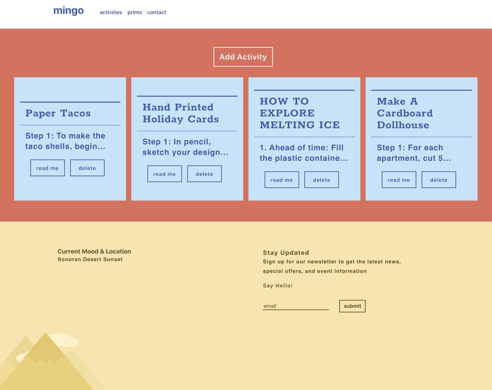
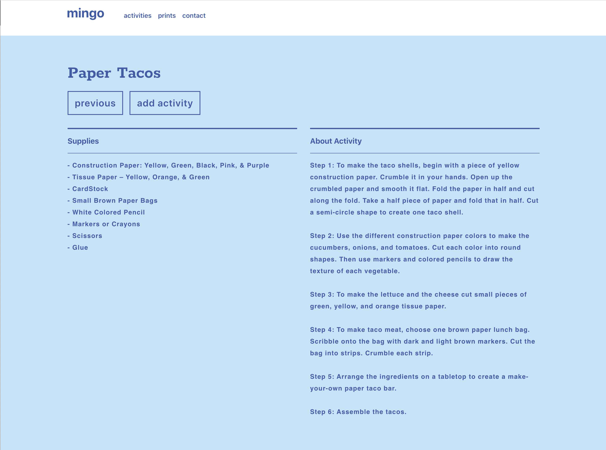

# mingo

# live site
```jumianddash
https://www.mingoscommunity.club
```

# GitHub
```github
https://github.com/jpgraziani/mingo-client-static
```

# ScreenShots
home screen:


Activity List page:


Activity page:


# Summary
This App will help users see activities in one location. Allow users to create a new activity and delete an activity.

# Fullstack App Built With
* React.js
* CSS
* Node.js
* Express
* PostgreSQL

# API documentation

#### /activities
- (/api/activities)
- GET: Returns a list of all current activities.
- POST: Create a new activity to the database

#### /activity/:id
- (/api/activity/:id)
- GET: Return a single activity
- DELETE: Remove a single activity from the database wtih a valid activity id